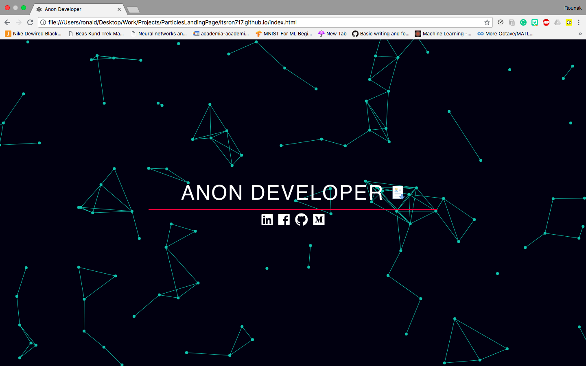

# ParticleGround-Portfolio

A particle-theme template as a landing page for your portfolio.

> [Demo](https://landing-page--itsron717.repl.co/)



# Using the Template

  - Fork and Clone the repository

    ```
    $ git clone https://github.com/itsron717/ParticleGround-Portfolio.git
    ```
 
  - Go inside the main repository
  
    ```
    $ cd ParticleGround-Portfolio
    ```
    
  - Modify `index.html` to change the names and links to point at your pages.
  
  - Upload your resume in the place of `Mazin Tagelsir resume.pdf` 
   

# References and Inspiration

This template is a minimal form of the [Particle Jekyll Template](https://github.com/nrandecker/particle).
